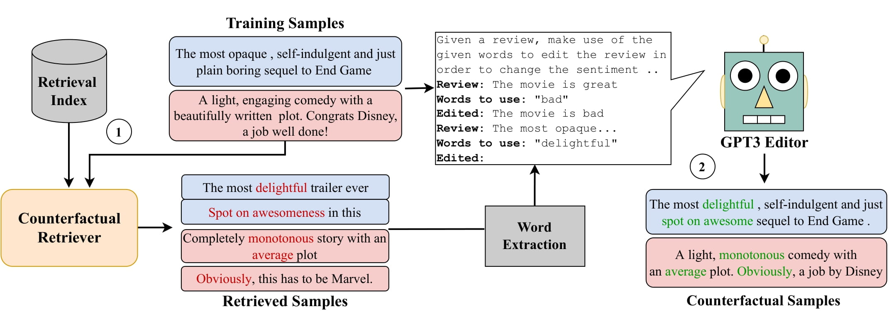

# CORE: A Retrieve-then-Edit Framework for Counterfactual Data Generation

This repository contains the code for the paper [CORE: A Retrieve-then-Edit Framework for Counterfactual Data Generation](https://arxiv.org/abs/2210.04873) to appear at Findings **EMNLP 2022**.


## Quick Links

- [Overview](#overview)
- [Setup](#setups)
- [Training](#Training)
    - [CFDPR](#cfdpr-training)
    - [Cross Encoder](#cross-encoder-training)
- [CORE](#generating-counterfactuals)
    - [Sentiment](#sentiment-ananlysis)
    - [Natural Language Inference](#natural-language-inference)
- [Data Augmentation](#data-augmentation)
- [Citation](#citation)
- [Acknowlegements](#acknowlegements)


## Overview
We present COunterfactual Generation via Retrieval and Editing (CORE), a retrieval-augmented generation framework for creating diverse counterfactual perturbations for CDA. For each training example, CORE first performs a dense retrieval over a task-related unlabeled text corpus using a learned bi-encoder and extracts relevant counterfactual excerpts. CORE then incorporates these into prompts to a large language model with few-shot learning capabilities, for counterfactual editing. Conditioning language model edits on naturally occurring data results in diverse perturbations.

<div style="text-align: center;">

</div>

## Setups

The code is based on python>=3.6.9 and uses the dependencies listed in requirements.txt. <br>
In addition to that, openai login key is required to access GPT-3.

Can download all the trained model checkpoints and datasets from here [GDrive](https://drive.google.com/drive/folders/11C8TtGWXaKfspKnNN_yk4IZNOe93_IXX?usp=sharing) <br>

The directory structure

- `cfdpr senti` : CFDPR model weights for sentiment analysis task
- `cfdpr nli`: CFDPR model weights for NLI
- `cross encoder nli`: Re-ranker weights for NLI
- `data`
    - `MNLI` : Data augmentation datasets + CORE counterfactuals
    - `IMDB` : Data augmentation datasets + CORE counterfactuals
    - `CFDPR Training data` : training data for both the tasks

## Training

The most important part of CORE is the retrieval stage, we need to train a retriever that can retrieve texts with the opposite relationship with the given input opposed to a traditional retriever. We make use of the DPR framework to train the retriever. 

### CFDPR

We train our counterfactual retriever using the DPR model. Refer to Section 3.1 of our paper for understanding the training data generation process. The training data can be dowloaded from [here](https://drive.google.com/drive/folders/1Dm2dgrnyW6uWTg1hoIDDVkXAE1IiLyzC?usp=share_link).

Download the data and move it to `core/CFDPR/downloads` folder. The following are the dataset names that can be used in training. <br>

- `mnli_train_eNc` & `mnli_dev_eNc`: NLI training & dev dataset
- `senti_tain` & `senti_dev`:  IMDB training & dev dataset


Run the following to train the CFDPR retriever
```
cd core/CFDPR
bash run_encoder.sh
```

### Cross Encoder

To improve the accuracy of counterfactual retrieval we train a re-ranker module (cross encoder) that re-ranks the text excerpts retrieved from CFDPR. <br>
Install the sentence transformers library (`pip3 install -U sentence-transformers`). 

Run
```python3 cross_nli.py --epochs 10 --bz 64 --train_file crossencoder_mnli_train.csv --val_file crossencoder_mnli_val.csv```

<br>

## Generating Counterfactuals 

For generating the counterfactuals the first step is to generate the search copora. Run the following code to encode and index the search copora. <br>
`Alert : This takes ~30GB disk space and use of GPU is a must`

**Note:** This stage is only a one time thing that has to be setup at the start, if the index has aleady been created skip to the retrive and edit step.

The encoded search corpus for both nli and sentiment are available at huggingface hub [sentiment-corpus](https://huggingface.co/datasets/tanay/sentiment-corpus), [nli-corpus](https://huggingface.co/datasets/tanay/nli-corpus) . Use this path as `encode_path` and just run `do_index`. <br>

Run `indexing.py` with the following parameters
- `do_encode` : to encode each text into a vector that could be used for retrieval
- `do_index`: to index the corpus using faiss
- `index_path`: the path to save the faiss index
- `encode_path`: the path to save the corpus embeddings
- `model_dir`: the CFDPR weights directory 

For NLI

```python 
python3 indexing.py \
 --do_encode \
 --do_index \
 --index_path [path] \
 --encode_path [path] \
 --model_dir ./cfdpr_models/nli \
 --n_gpu 3 \
```

For Sentiment

```python
python3 indexing.py \
 --do_encode \
 --do_index \
 --index_path [path] \
 --encode_path [path] \
 --model_dir ./cfdpr_models/senti \
 --n_gpu 3 \
```
<br>

Onces the indexs have been created, we can now perform the retrive and edit step. First cd to core. Based on the `retrieve`, `edit` and `retrieve-edit` argument you can choose which augmentation strategy you want to do. Only `retrieve` corresponds to the CF-DPR counterfactuals, `edit` to GPT-3 counterfactuals and `retrieve-edit` to CORE counterfactuals.

Run `main.py` with the following parameters
- `task` : senti/nli
- `cfdpr_checkpoint`: directory of stored CFDPR weights
- `corpus`: the search corpus which the retriever will use to retrieve counterfactuals
- `index`: the faiss index for the given corpus
- `input_file`: list of json file as input with the following format
    - `nli`: keys must be `premise`, `hypothesis`, `label`, where label values from [0 (entailment), 1 (neutral), 2 (contradiction)]
    - `sentiment`: keys must be `text`, `label`, where label values from [0 (negative), 1 (positive)]
- `output_file`: list of json file to save the outputs

<br>

### Sentiment Ananlysis

```python
python3 main.py \
    --cuda \
    --task senti \
    --strategy [edit/retrieve/retrieve-edit] \
    --cfdpr_checkpoint ../cfdpr_models/senti \
    --corpus [path] \
    --index [index] \
    --input_file [path] \
    --output_file [path] \
```


### Natural Language Inference

`do_reranking` is requried only for `nli`

```python
python3 main.py \
    --cuda \
    --task nli \
    --strategy [edit/retrieve/retrieve-edit] \
    --do_reranking \
    --cross_checkpoint [path] \
    --cfdpr_checkpoint ../cfdpr_models/nli \
    --corpus [path] \
    --index [index] \
    --input_file [path] \
    --output_file [path] \
```

## Data Augmentation

For training and testing models on augmented data, use the scripts provided in the `nli` and `sentiment` folder. Can download the CORE Counterfactuals from [here](https://drive.google.com/drive/folders/11C8TtGWXaKfspKnNN_yk4IZNOe93_IXX?usp=sharing). Update the data directory path accordingly. <br>


- `run_nli.sh` / `run_senti.sh` : To fine-tune DeBERTa base on the augmented dataset 
- `test_all.sh`: Testing the finetuned model

## Citation

Please cite our paper if you use CORE in your work:
```
@inproceedings{dixit-etal-2022-core,
    title = "CORE: A Retrieve-then-Edit Framework for Counterfactual Data Generation",
    author = "Dixit, Tanay and Paranjape, Bhargavi and Hajishirzi, Hannaneh and Zettlemoyer, Luke",
    booktitle = "Findings of the Association for Computational Linguistics: EMNLP 2022",
    year = "2022",
    publisher = "Association for Computational Linguistics",

}
```

## Acknowlegements

Parts of the code have been borrowed from [DPR](https://github.com/facebookresearch/DPR) and [few-shot-learning](https://github.com/tonyzhaozh/few-shot-learning) repos.
